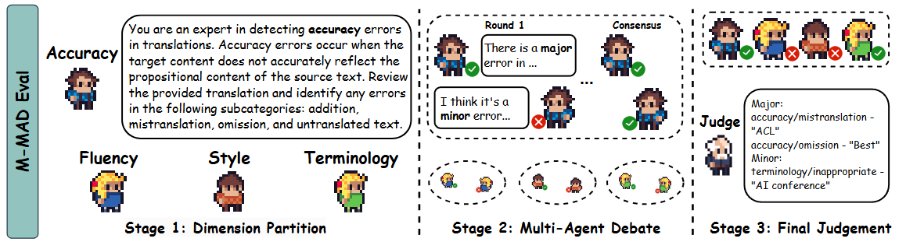

# M-MAD: Multidimensional Multi-Agent Debate for Advanced Machine Translation Evaluation


## **🤖** About M-MAD<a name="about"></a>

The **M-MAD** framework is a systematic LLM-based multi-agent framework for advanced LLM-as-a-judge MT evaluation. It operates in three stages:

1. **Dimension Partition**: Decomposing the heuristic MQM annotation guideline into distinct dimensions for independent LLM-as-a-judge assessments.
2. **Multi-Agent Debate**: Conducting multi-agent debates within each dimension, harnessing LLMs' inherent knowledge, reasoning, and collaborative abilities.
3. **Final Judgment**: Synthesizing the debated outcomes through a final judge agent to produce a comprehensive evaluation judgment.



## **📄** Paper

For a detailed explanation of the M-MAD framework, please refer to the paper:  
[Multidimensional Multi-Agent Debate for Advanced Machine Translation Evaluation (arXiv)](https://arxiv.org/pdf/2412.20127)

## Code Structure
- `code/`: Code and prompts for all stages
- `data/`: Input data and output-annotated data  
  Our input data is sourced from WMT-23 Metrics Shared Task. You can also downloaded it from [https://github.com/google-research/mt-metrics-eval](https://github.com/google-research/mt-metrics-eval) or https://wmt-metrics-task.github.io/.
- `metrics_scores/`: Meta-evaluation results

## **💻** Running the Code

### 1) Environment Setup ###
```cmd
git clone https://github.com/SU-JIAYUAN/M-MAD.git
cd M-MAD
conda create -n MMMD python=3.10
conda activate MMMD
pip install -r requirements.txt
```
### 2) Stage 1 (Dimension Partition)

```bash
sh run_stage1.sh
```

### 3) Stage 2 & 3 (Muti-Agent Debate & Final Judgement)

```bash
sh run_stage2_3.sh
```

### 4) Meta-evaluation

To run the meta-evaluation for the metrics, execute the following file, where we use the evaluation tool from https://github.com/google-research/mt-metrics-eval.

```bash
wmt23_metrics.ipynb
```

## Citation

```
@article{feng2024mmad,
  title={M-MAD: Multidimensional Multi-Agent Debate Framework for Fine-grained Machine Translation Evaluation},
  author={Feng, Zhaopeng and Su, Jiayuan and Zheng, Jiamei and Ren, Jiahan and Zhang, Yan and Wu, Jian and Wang, Hongwei and Liu, Zuozhu},
  journal={arXiv preprint arXiv:2412.20127},
  year={2024}
}
```